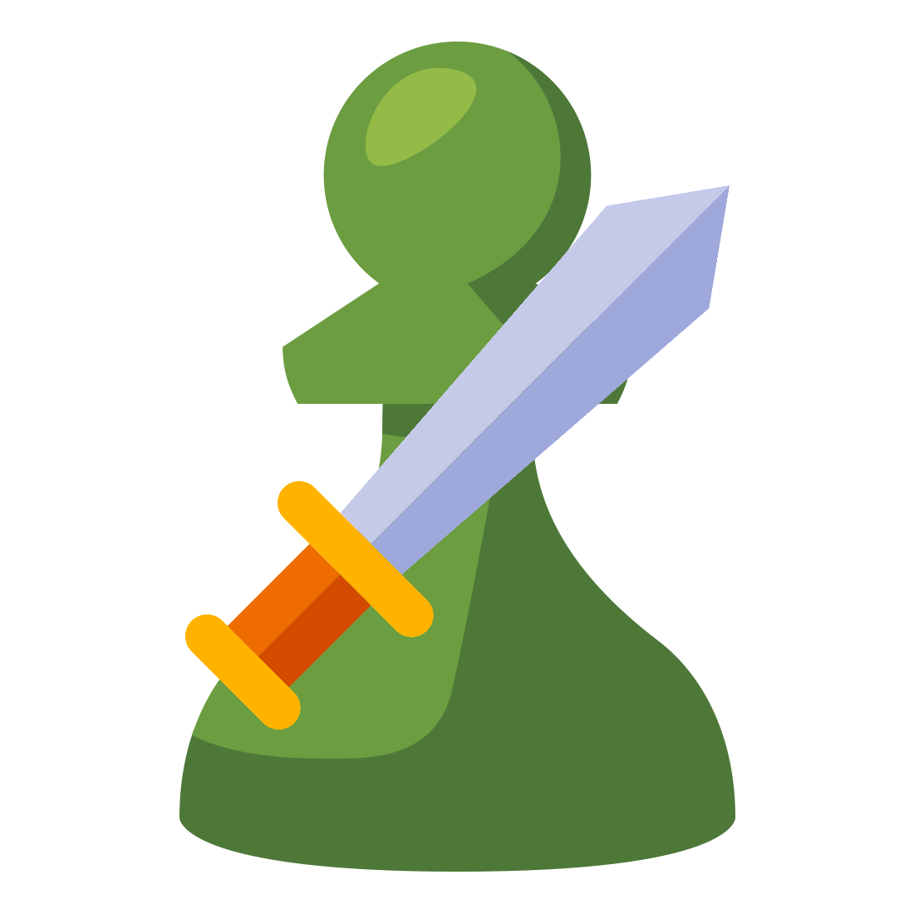

<p align="center">
    
    <br><br>
    <a href="https://discord.gg/3kh0"></a>
    <a href="https://github.com/3kh0/ChessSword/releases"></a>
</p>

# Chess Sword

Chess bot using stockfish to highlight the best moves on Chess.com

**Note**: You will get banned for using this in online play on chess.com, only use this as a training tool for improvement. I am not responsible for your account getting closed.

## Features

- **Eval bar** See what stockfish thinks of your current position in the game.
- **Best move highlight** See the best move suggested by stockfish.
- **Opening book** See the following moves suggested based on your current opening in the game.
- **Ajustable depth** Set a custom engine depth from 3 up to 35.

## Install
This extension is only for chrome at the moment, support for firefox browsers is coming soon

It is not on the Chrome Store, you must install it manually by following the steps below:

1. Download the extension and extract it: [Download page](https://github.com/3kh0/ChessSword/releases)
2. Go to the Extensions page by entering `chrome://extensions` in a new tab, or go to the `Manage extensions` page.
3. On the top right corner, you should see an option named `Developer mode`, enable it.
4. A button named `Load unpacked` will show up in the top left corner, click it.
5. Select the extension folder which you have just extracted. *The right folder should have a file called `manifest.json` in it*.

*For more details, see [the official instructions](https://developer.chrome.com/docs/extensions/mv3/getstarted/development-basics/#load-unpacked)*.

## Contributing

To contribute to the Chess Sword project, you can follow these steps:

1. Fork and Clone the repository:

```
git clone https://github.com/your-username/ChessSword.git
```

2. Make your changes: You can now make the necessary modifications or additions to the project code using your preferred code editor. Make sure you test your changes.
3. Create a pull request: Provide a clear and concise description of your changes and submit the pull request.

## License

This repo is licensed under the MIT license. You can see the [LICENSE](LICENSE) file for details.